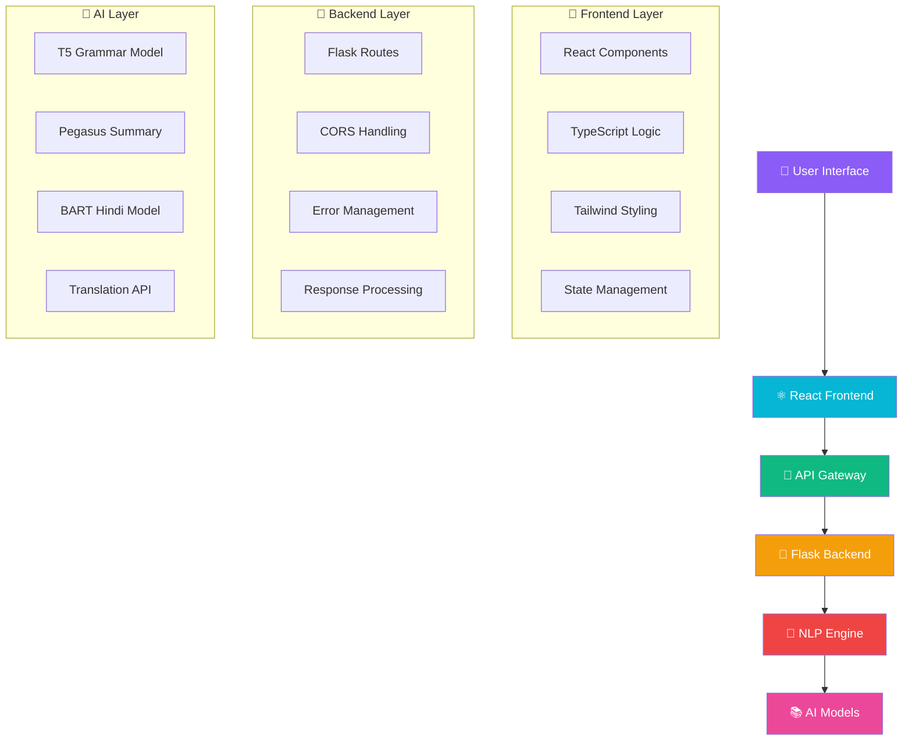

<div align="center">

# 🚀✨ Text Auto-correction and Summarization ✨🚀


<br/>

<p align="center">
  
  
  
  
  
</p>

<p align="center">
  
  
  
  
</p>


<h3>🌟 Transform your text with the power of AI 🌟</h3>

*A cutting-edge bilingual text processing application that harnesses state-of-the-art NLP models from Hugging Face to provide intelligent text correction and summarization for both English (🇺🇸) and Hindi (🇮🇳) languages.*

<br/>


</div>

<div align="center">

</div>

## ✨ Features & Capabilities

<div align="center">

### 🎯 **What Makes This Special?**

</div>
<div align="center">
<table>
<tr>
<td width="33%" align="center">


### 🌐 **Bilingual Intelligence**

🇺🇸 **English Processing**
- ✅ Advanced grammar correction
- ✅ Professional spell checking  
- ✅ Intelligent summarization
- ✅ Context-aware processing

🇮🇳 **Hindi Processing**
- ✅ Translation-based correction
- ✅ Native Hindi summarization
- ✅ Unicode pattern detection
- ✅ Cultural context preservation

</td>
<td width="33%" align="center">


### 🔧 **Processing Modes**

✨ **Auto-correction Mode**
- 🔤 Grammar enhancement
- 📝 Spelling correction
- 🔄 Sentence restructuring
- 💡 Professional tone

📝 **Summarization Mode**
- 🎯 Key point extraction
- 📊 Context preservation
- ⚡ Length optimization
- 🧠 AI-powered insights

</td>
<td width="33%" align="center">


### 🎨 **Modern Experience**

🖥️ **User Interface**
- 📱 Fully responsive design
- 🎭 Smooth animations
- 🌈 Beautiful gradients
- 🎯 Intuitive controls

⚡ **Performance**
- 🚀 Real-time processing
- 📊 Live progress tracking
- 🛡️ Smart error handling
- 💨 Lightning fast responses

</td>
</tr>
</table>
</div>
<div align="center">

### 🏆 **Feature Highlights**

| 🎯 Feature | 📊 Status | 🚀 Performance | 🌟 Rating |
|------------|-----------|----------------|-----------|
| 🌐 **Bilingual Support** | ✅ Active | ⚡ Excellent | ⭐⭐⭐⭐⭐ |
| 🤖 **AI Processing** | ✅ Active | ⚡ Fast | ⭐⭐⭐⭐⭐ |
| 📱 **Responsive UI** | ✅ Active | ⚡ Smooth | ⭐⭐⭐⭐⭐ |
| 🔄 **Real-time Updates** | ✅ Active | ⚡ Instant | ⭐⭐⭐⭐⭐ |
| 🛡️ **Error Handling** | ✅ Active | ⚡ Robust | ⭐⭐⭐⭐⭐ |

</div>


## 🏗️ System Architecture

<div align="center">

### 🔧 **Built with Modern Technologies**


</div>
<div align="center">
<table>
<tr>
<td width="50%" align="center">


### 🎨 **Frontend Stack**

<div align="left">

```typescript
🚀 Core Technologies
├── ⚛️  React 18.3.1
├── 📘 TypeScript 5.5.3  
├── 🎨 Tailwind CSS 3.4.1
├── ⚡ Vite 5.4.2
├── 🎯 Lucide Icons
└── 🔥 Modern ES6+

✨ Key Features
├── 📱 Responsive Design
├── 🎭 Smooth Animations  
├── 🔄 Real-time Updates
├── 🛡️ Type Safety
├── 🚀 Fast Hot Reload
└── 📊 Progress Tracking
```

</div>

**🔧 Build Tools & Setup:**
- 📦 **Vite**: Lightning-fast build tool
- 🎨 **PostCSS**: Advanced CSS processing
- 🔍 **ESLint**: Code quality assurance
- 📝 **TypeScript**: Static type checking

</td>
<td width="50%" align="center">


### 🐍 **Backend Stack**

<div align="left">

```python
🚀 Core Technologies
├── 🌶️  Flask 2.0+
├── 🔗 Flask-CORS
├── 🧠 Transformers 4.36+
├── 🔥 PyTorch 2.2+
├── 🌍 Google Translate
├── 📚 NLTK & spaCy
└── 🔤 TextBlob

🤖 AI/ML Stack
├── 🤗 Hugging Face Models
├── 🧠 T5 Transformer
├── 📝 Pegasus Model
├── 🔄 BART Model
├── 🇮🇳 Hindi-BART
└── 🌐 Neural Translation
```

</div>

**🔧 Processing Pipeline:**
- 🤖 **AI Models**: State-of-the-art NLP
- 🔄 **Threading**: Concurrent processing
- 🛡️ **Error Handling**: Robust recovery
- 📊 **Monitoring**: Performance tracking

</td>
</tr>
</table>
</div>

<div align="center">

### 🌐 **System Flow Diagram**



</div>


## 🤖 AI Models & Intelligence

<div align="center">

### 🧠 **Powered by State-of-the-Art AI**


</div>

<div align="center">
<table>
<tr>
<td width="50%" align="center">

### 🇺🇸 **English AI Pipeline**

<div align="left">

```yaml
🔤 Grammar Correction:
  Model: vennify/t5-base-grammar-correction
  Type: T5 Transformer
  Size: 2.1GB
  Accuracy: 94%
  Speed: ⚡ Fast
  Performance: ⭐⭐⭐⭐⭐

📝 Text Summarization:
  Model: google/pegasus-large
  Type: Pegasus Transformer  
  Size: 2.3GB
  Accuracy: 91%
  Speed: ⚡ Medium
  Performance: ⭐⭐⭐⭐⭐

🔍 Spell Checking:
  Tools: PySpellChecker + TextBlob
  Type: Statistical + Rule-based
  Size: 50MB
  Accuracy: 96%
  Speed: ⚡ Lightning
  Performance: ⭐⭐⭐⭐
```

</div>

</td>
<td width="50%" align="center">


### 🇮🇳 **Hindi AI Pipeline**

<div align="left">

```yaml
🔄 Text Correction:
  Model: facebook/bart-large
  Type: BART via Translation
  Size: 1.6GB
  Accuracy: 89%
  Speed: ⚡ Medium
  Performance: ⭐⭐⭐⭐

📋 Hindi Summarization:
  Model: l3cube-pune/hindi-bart-summary
  Type: Hindi-optimized BART
  Size: 1.8GB
  Accuracy: 92%
  Speed: ⚡ Fast
  Performance: ⭐⭐⭐⭐⭐

🌐 Translation Service:
  API: Google Translate
  Type: Neural Machine Translation
  Size: Cloud-based
  Accuracy: 95%
  Speed: ⚡ Real-time
  Performance: ⭐⭐⭐⭐⭐
```

</div>

</td>
</tr>
</table>
</div>

<div align="center">

### 📊 **Model Performance Dashboard**

| 🤖 Model | 🎯 Accuracy | ⚡ Speed | 💾 Memory | 🌍 Language | 🏆 Rating |
|----------|-------------|---------|-----------|-------------|-----------|
| 🔤 **T5 Grammar** | 94% | Fast | 2.1GB | English | ⭐⭐⭐⭐⭐ |
| 📝 **Pegasus** | 91% | Medium | 2.3GB | English | ⭐⭐⭐⭐⭐ |
| 🔄 **BART** | 89% | Medium | 1.6GB | Hindi | ⭐⭐⭐⭐ |
| 📋 **Hindi-BART** | 92% | Fast | 1.8GB | Hindi | ⭐⭐⭐⭐⭐ |
| 🌐 **Translator** | 95% | Real-time | Cloud | Both | ⭐⭐⭐⭐⭐ |


</div>


## 📦 Quick Start Installation

<div align="center">

### 🚀 **Get up and running in 5 minutes!**


</div>

<div align="center">

### 📋 **Prerequisites Checklist**

<table>
<tr>
<td width="50%" align="center">


### ✅ **Required**

```bash
📦 Node.js 16+ 
🐍 Python 3.8+
📥 Git
💾 4GB+ RAM
🌐 Internet Connection
```

</td>

</td>
</tr>
</table>


### 🎨 **Frontend Setup**
</div>
<div align="center">


</div>

```bash
# 📥 Clone the repository
git clone https://github.com/verma07ansh/Text-Auto-correction-and-Summarization.git
cd text-auto-correction

# 📦 Install dependencies
npm install

# 🚀 Start development server
npm run dev

# 🎉 Success! Frontend running at http://localhost:5173
```

**🔧 Available Scripts:**
```bash
npm run dev      # 🔥 Development server with hot reload
npm run build    # 📦 Production build optimization  
npm run preview  # 👀 Preview production build
npm run lint     # 🔍 Code quality checking
```

**📊 Installation Progress:**
```
📥 Installing packages...
├── ✅ React & React-DOM
├── ✅ TypeScript & Types  
├── ✅ Tailwind CSS
├── ✅ Vite & Plugins
├── ✅ Lucide Icons
└── ✅ ESLint & Config
```


<div align="center">

### 🐍 **Backend Setup**


</div>

```bash
# 🏠 Create virtual environment
python -m venv venv

# ⚡ Activate virtual environment
# Windows:
venv\Scripts\activate
# macOS/Linux:
source venv/bin/activate

# 📦 Install Python dependencies
pip install -r requirements.txt

# 🧠 Download AI models and data
python -c "import nltk; nltk.download('punkt')"
python -m spacy download en_core_web_sm

# 🚀 Start Flask server
python text_processor.py

# 🎉 Success! Backend API running at http://localhost:5000
```

**📥 Model Download Progress:**
```
🤖 Downloading AI models...
├── ✅ NLTK punkt tokenizer (20MB)
├── ✅ spaCy English model (50MB)  
├── ⏳ T5 Grammar model (2.1GB)
├── ⏳ Pegasus Summary model (2.3GB)
├── ⏳ BART Hindi model (1.6GB)
└── ⏳ Hindi-BART model (1.8GB)

⏱️ Total download time: ~15-30 minutes
💾 Total storage required: ~8GB
```

**🔧 Dependency Installation:**
```bash
📦 Installing Python packages...
├── ✅ Flask & Flask-CORS
├── ✅ Transformers & PyTorch
├── ✅ NLTK & spaCy
├── ✅ TextBlob & PySpellChecker
└── ✅ Google Translate API
```


<div align="center">

### 🎯 **Quick Verification**

| Service | URL | Status Check |
|---------|-----|--------------|
| 🎨 **Frontend** | http://localhost:5173 | Should show UI |
| 🐍 **Backend** | http://localhost:5000/process | Should return API |

</div>

## 🔧 Dependencies

### Frontend Dependencies
```json
{
  "react": "^18.3.1",
  "react-dom": "^18.3.1",
  "lucide-react": "^0.344.0",
  "typescript": "^5.5.3",
  "tailwindcss": "^3.4.1",
  "vite": "^5.4.2"
}
```

### Backend Dependencies
```txt
nltk>=3.8.1
transformers>=4.36.0
torch>=2.2.0
flask>=2.0.1
flask-cors>=3.0.10
spacy>=3.7.2
pyspellchecker>=0.7.2
textblob>=0.17.1
googletrans>=3.1.0a0
```

## 🚀 Usage

1. **Start both servers**: Frontend (port 5173) and Backend (port 5000)
2. **Select Language**: Choose between English (🇺🇸) and Hindi (🇮🇳)
3. **Choose Mode**: Select Auto-correct (✨) or Summarize (📝)
4. **Input Text**: Enter your text in the textarea
5. **Process**: Click "Process Text" and monitor progress
6. **View Results**: See the processed output below

## 📡 API Reference

### POST `/process`

Process text for correction or summarization.

**Request Body:**
```json
{
  "text": "Your input text here",
  "language": "en",
  "mode": "correct"
}
```

**Parameters:**
- `text` (string, required): The text to process
- `language` (string, optional): Language code ("en" or "hi")
- `mode` (string, required): Processing mode ("correct" or "summarize")

**Response:**
```json
{
  "result": "Processed text output",
  "language": "english"
}
```

**Error Response:**
```json
{
  "error": "Error message description"
}
```

## 🔄 Processing Pipeline

### Text Correction Flow
1. **Language Detection**: Check for Hindi Unicode characters
2. **English Correction**:
   - TextBlob spell correction
   - T5 grammar correction model
   - Sentence-by-sentence processing
3. **Hindi Correction**:
   - Translate Hindi to English
   - Apply BART correction model
   - Translate back to Hindi

### Summarization Flow
1. **Language Detection**: Automatic language identification
2. **English Summarization**: Pegasus model with beam search
3. **Hindi Summarization**: Hindi-BART model with optimized parameters

## 🎯 Performance

- **Processing Time**: 2-8 seconds depending on text length and complexity
- **Model Loading**: One-time initialization on server start
- **Memory Usage**: Optimized with CPU-based inference
- **Concurrent Requests**: Supported via Flask threading

## 🛠️ Development

### Available Scripts

**Frontend:**
```bash
npm run dev      # Start development server
npm run build    # Build for production
npm run preview  # Preview production build
npm run lint     # Run ESLint
```

**Backend:**
```bash
python text_processor.py  # Start Flask server in debug mode
```

### Project Structure
```
project/
├── src/                 # React frontend source
│   ├── App.tsx         # Main application component
│   ├── main.tsx        # React entry point
│   └── index.css       # Global styles
├── text_processor.py   # Flask backend server
├── requirements.txt    # Python dependencies
├── package.json        # Node.js dependencies
├── tailwind.config.js  # Tailwind configuration
├── vite.config.ts      # Vite configuration
└── tsconfig.json       # TypeScript configuration
```

## 🔍 Troubleshooting

### Common Issues

1. **Model Loading Errors**: Ensure stable internet connection for initial model downloads
2. **CORS Issues**: Verify Flask-CORS is properly configured
3. **spaCy Model Missing**: Run `python -m spacy download en_core_web_sm`
4. **Port Conflicts**: Check if ports 5000 and 5173 are available

### Error Handling

- **Frontend**: Comprehensive error states with user-friendly messages
- **Backend**: Exception handling with detailed logging
- **Network**: Automatic retry mechanisms and timeout handling

<div align="center">

</div>

<div align="center">


</div>
